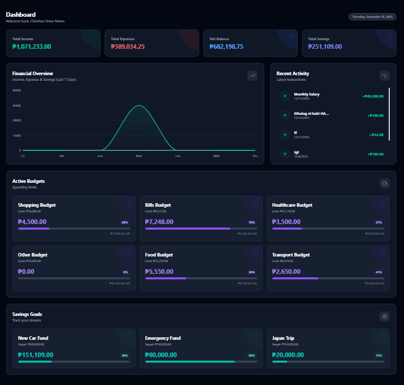
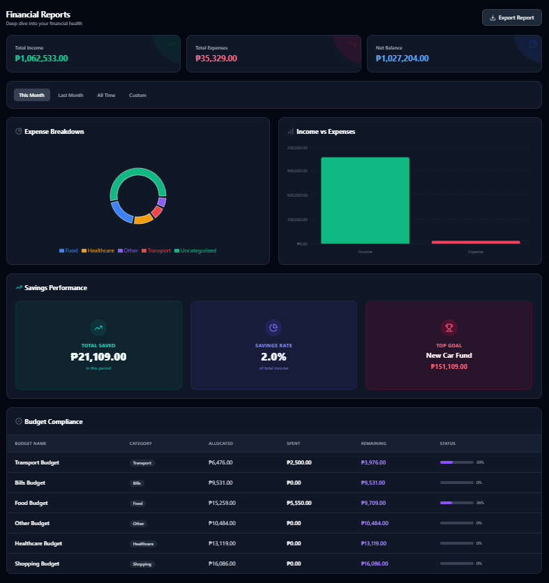
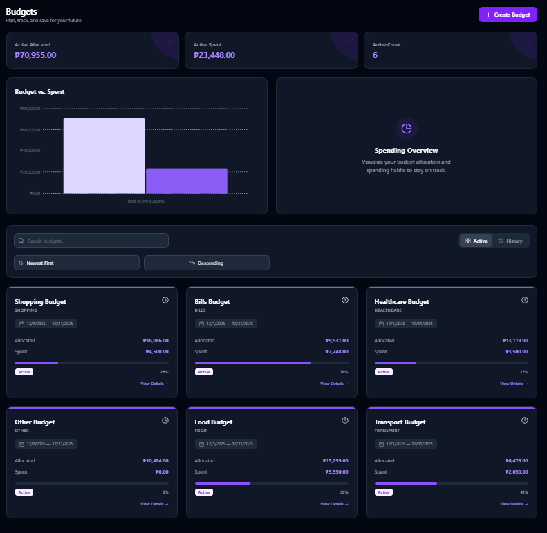
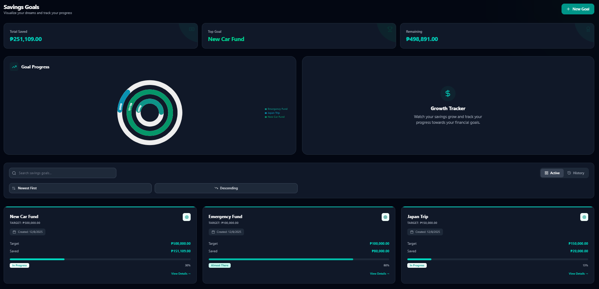

<align="center">
  
</p>

<h1 align="center">PFT Money Tracker</h1>

<p align="center">
  <strong>Master Your Money, Effortlessly.</strong><br />
  A professional-grade personal finance tracking suite built for speed, security, and deep financial insights.
</p>

<p align="center">
  
  
  
  
  
  
</p>

---

## 🚀 Overview

**PFT Money Tracker** is a comprehensive financial management system designed to help you take full control of your wealth. Whether you're tracking daily expenses, planning long-term savings, or generating deep-dive reports for audit, PFT provides the tools you need in a sleek, modern interface.

Built with a high-performance **React** frontend and a robust **Laravel** backend, powered by **Docker**, PFT is designed for both personal use and professional financial monitoring.

---

## ✨ Key Features

### 📊 Interactive Dashboard
*   **Real-time Insights**: View your Total Income, Expenses, Net Balance, and Savings at a glance.
*   **Visual Trends**: 7-day retrospective charts for income/expense flow.
*   **Quick Action**: Monitor active budgets and savings goals without leaving the homepage.

### 💸 Transaction Management
*   **Smart Categorization**: Organically group your spending by type.
*   **CSV Import**: Batch-upload your bank statements with ease.
*   **Time-Locked Editing**: Maintain data integrity with professional entry windows.

### 🎯 Savings & Budgets
*   **Goal Tracking**: Set targets for your dreams (e.g., House, Travel) and track progress with radial charts.
*   **Budget Compliance**: Set limits for categories and receive visual warnings as you approach 100%.
*   **Surplus Analysis**: Distinguish between base goals and bonus savings.

### 📄 Enterprise-Grade Reports
*   **Multi-Sheet Excel Export**: Generate professional reports including:
    *   Financial KPIs & Performance Indicators
    *   Detailed Budget Compliance Variance
    *   Savings Growth & Top Performing Goals
    *   Raw Transaction Audit Logs
*   **Dynamic Currency Support**: The export respects your local currency (USD, PHP, etc.).

### 🌐 Global & Accessible
*   **Internationalization**: Full support for **English**, **Filipino**, and **Chinese**.
*   **Adaptive Theming**: Beautiful **Dark Mode**, **Light Mode**, and System Preference support.
*   **Mobile First**: Fully responsive design for managing money on the go.

---

## 🛠️ Tech Stack

### Frontend
- **React 18**: Modern component-based architecture.
- **TanStack Query (React Query)**: For high-performance data fetching and caching.
- **Tailwind CSS**: Utility-first styling with sophisticated dark mode.
- **Framer Motion**: For smooth, premium UI transitions and micro-animations.

### Backend
- **Laravel 11**: Secure and expressive PHP framework.
- **Laravel Sanctum**: Robust SPA and API authentication.
- **Redis**: High-speed caching and background queue processing.
- **MySQL 8.0**: Reliable relational data storage.

### Infrastructure
- **Docker & Docker Compose**: Seamless environment orchestration.
- **Nginx**: High-performance web server.
- **PHP-FPM**: Optimized PHP execution.

---

## 🚀 Quick Start

Ensure you have [Docker](https://www.docker.com/) and [Docker Compose](https://docs.docker.com/compose/) installed.

1. **Clone the Repo**
   ```bash
   git clone https://github.com/motaschristian9-jpg/PFTgithub.git
   cd PFTMoneyTracker
   ```

2. **Launch Services**
   ```bash
   docker compose up -d --build
   ```

3. **Initialize Database**
   ```bash
   docker exec pft-backend php artisan migrate --seed
   ```

4. **Access the App**
   - **Frontend**: [http://localhost:5173](http://localhost:5173)
   - **Backend API**: [http://localhost:8000](http://localhost:8000)
   - **phpMyAdmin**: [http://localhost:8080](http://localhost:8080)

---

## 📸 Screenshots

| Dashboard | Reports |
| :---: | :---: |
|  |  |

| Budgets | Savings |
| :---: | :---: |
|  |  |

---

## 🛡️ License

This project is licensed under the MIT License - see the [LICENSE](LICENSE) file for details.

---

<p align="center">
  Built with ❤️ by PFT MOTAS GROUP!
</p>
